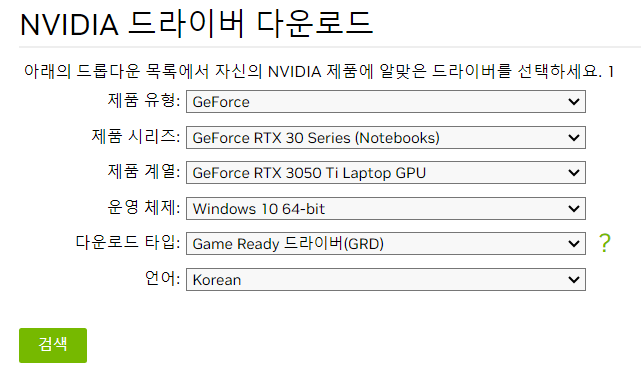
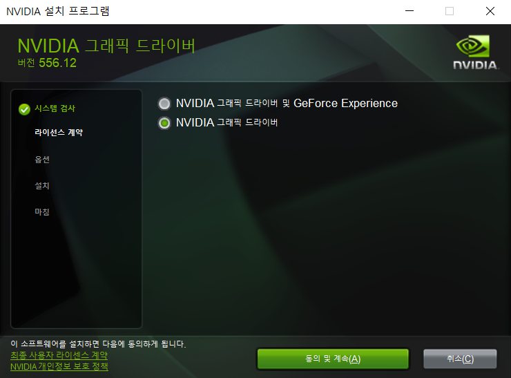
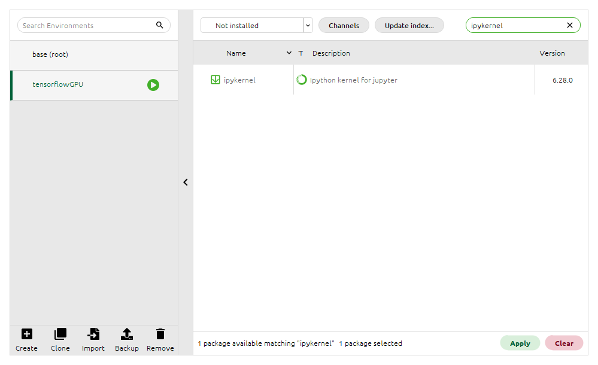

# GPU 셋팅 가이드

## 준비물
* 좋은 그래픽 카드!
* python 3.9이상
* tensorflow 2.x 이상
    * 그래픽 카드에 따라 availablity 확인해서 적용

## 그래픽카드 확인
* 윈도우키 + s > dxdiag 검색 > 디스플레이 or 렌더링

    * 현 실습은 RTX 3050 Ti Labtop GPU

## 그래픽카드 capability 확인
* NVIDIA 공식홈페이지에서 확인 가능
    * https://developer.nvidia.com/cuda-gpus

    * 주의! 노트북과 데스크톱은 카테고리로 구분이 되어있다!
    
    * 현 실습은 RTX 3050 Ti Labtop 기준 : 8.6

## 그래픽카드 드라이버 설치
* 그래픽카드 드라이버 홈페이지
    * https://www.nvidia.co.kr/Download/index.aspx?lang=kr
* 그래픽카드에 맞는 드라이버 옵션 선택
    
* 다운로드
    
    * 버전확인 : 556.12
* 설치
    
    * GeForce Experience(선택사항)
        * 게임용 어플리케이션이지만, 자동업데이트에 용이함
    * (2024-07-23) 현재 RTX 40(notebook) 시리즈에서 수동 드라이브 설치가 안되는 것으로 확인
        * 해결을 위해 Geforece Experience를 설치하여 자동으로 NVIDIA 드라이버를 설치하는 방법을 써야한다.
        
        * Geforece Experience 지금 다운로드 클릭하여 다운로드 후 설치 진행
        
        * 드라이버 설치 확인
        

## CUDA 설치
* 호환가능한 CUDA 버전 확인
    * https://docs.nvidia.com/cuda/cuda-toolkit-release-notes/index.html
    
    * 주의!
        * 현재 tensorflow-gpu은 윈도우에서 CUDA는 11.2, cudnn은 8.1을 지원하고 있다.
        * 호환성을 위해서라도 꼭 위의 버전을 맞춰서 설치를 진행해야한다.
        * 참고 : https://www.tensorflow.org/install/source_windows?hl=ko#gpu
* CUDA 설치 홈페이지
    * https://developer.nvidia.com/cuda-toolkit-archive
    * 현재 환경에 맞게 CUDA 설치
    
    * CUDA 설치
    
    * 사용자 정의 설치 선택해서 진행
    
    * 전체옵션 선택 후 진행
    
* CUDA 버전 확인
    * 콘솔창
        ```
        nvidia-smi
        ```
        * 현재 콘솔창에서 보이는 버전은 GPU 드라이버가 설치한 버전이므로, 반드시 CUDA를 설치한 후 경로를 설정하여 사용해야한다.
        * 윈도우 검색 > 시스템 환경 변수
            
        * 환경변수 추가
            

## Cudnn 설치
* Cudnn을 설치하기 위해서는 NVIDIA에 회원가입을 한 후, 로그인해야한다.
* 로그인 후 Cudnn 다운로드 홈페이지에 접속
    
    * https://developer.nvidia.com/cudnn-archive
* Cudnn 8.1 버전을 선택
    
* 다운로드 받은 zip파일을 풀어서, CUDA 폴더에 넣기
    * CUDA 디렉토리 위칭 : C:\Program Files\NVIDIA GPU Computing Toolkit\CUDA\v11.2
    * Cudnn 파일
    
    * CUDA, Cudnn 이동 전
    
    * CUDA, Cudnn 이동 후
    
* Cudnn 확인
    * 콘솔창
        ```
        nvcc -V
        ```
        

## 아나콘다 설치
* 아나콘다 홈페이지 접속
    * https://www.anaconda.com/download
    
        * Skip registration 클릭후 아나콘다 파일 다운로드
    * 아나콘다 설치 파일 실행
    
        * 옵션은 그대로 그냥 설치!
    * 아나콘다 실행
    
    
## 아나콘다 환경설정
* 아나콘다 Eviroments 클릭 > 아나콘다 Create 클릭
    
* 아나콘다 env 생성
    
    * tensorflow-gpu를 사용하기 위해서 파이썬 버전 3.9로 설정
* env 생성 확인<br>
    
* 라이브러리 설치
    * 라이브러리 미설치 목록으로 변경
    
    * 라이브러리 검색창에서 "ipykernel" 검색 후 설치
    
        * ipykernel 설치에 필요한 다른 라이브러리도 함께 설치!
    * 라이브러리 검색창에서 "tensorflow-gpu" 검색 후 설치
    
        * base는 옛날 버전이기 때문에 설치하지 않는다.
    * Home 클릭
    
    * JupyterLab 설치
    
* 주의! 현재 tensorflow-gpu 2.6.0버전은 numpy 1.20 버전만 지원을 한다! 꼭 버전을 확인하고 다운그레이드를 해야한다.
    

## GPU 확인
* JupyterLab 실행
    
* Chrome으로 실행
        
* 초기 JupyterLab 화면
    
* 왼쪽 사이드바(디렉토리 창)에서 원하는 위치로 이동
    
    * 위치로 이동 후 Python3(kernel) 선택
* GPU 버전 확인
    ```
    from tensorflow.python.client import device_lib
    print(device_lib.list_local_devices())
    ```
    